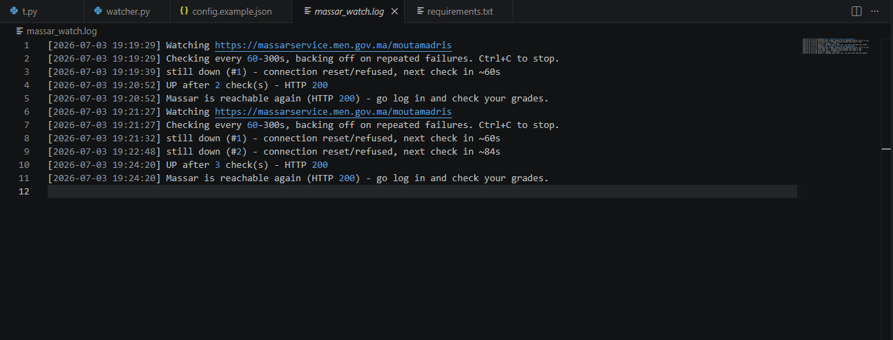

# Massar Watcher


A lightweight Python utility that monitors the Morocco Massar portal and notifies you as soon as it becomes reachable during periods of heavy traffic.


## Screenshot




## Quick Start

```bash
git clone https://github.com/Nodix01/massar-watcher.git
cd massar-watcher
pip install -r requirements.txt
python watcher.py
```


## Features

- Exponential backoff to reduce unnecessary requests
- Configurable polling interval
- Desktop sound notification
- Optional Discord webhook notification
- Lightweight and easy to run
- Cross-platform (Windows, Linux, macOS)
- Timestamped console logging

  

## Why?

Every year, especially during Morocco's baccalaureate results period, the Massar portal experiences a surge in traffic. This can make the website slow or temporarily unavailable, leaving many students and parents repeatedly refreshing the page for long periods.

Massar Watcher automates that process by periodically checking the portal and notifying you as soon as it becomes reachable again.

I originally built this as a personal utility and have now made it public so others can use and improve it.

## Installation

Clone the repository:

```bash
git clone https://github.com/Nodix01/massar-watcher.git
cd massar-watcher
```

Install the required dependency:

```bash
pip install -r requirements.txt
```

## Configuration

Edit the configuration variables near the top of `watcher.py` to customize:

- Target URL
- Check interval
- Maximum backoff
- Discord webhook (optional)

## Usage

Run the watcher:

```bash
python watcher.py
```

The script will periodically check whether the Massar portal is reachable. Once the website responds successfully, it will:

- Play a notification sound
- Print a message to the console
- Optionally send a Discord webhook notification

## Requirements

- Python 3.10 or newer
- Internet connection

## Disclaimer

This project is **not affiliated with Massar or the Moroccan Ministry of National Education.**

It does not log into accounts, bypass authentication, access student information, or retrieve grades. It only checks whether the public portal is reachable and notifies the user when it becomes available.

## Contributing

Bug reports, feature requests, and pull requests are welcome. If you have ideas for improving reliability or adding new notification methods, feel free to open an issue or submit a pull request.

## License

This project is licensed under the MIT License.
